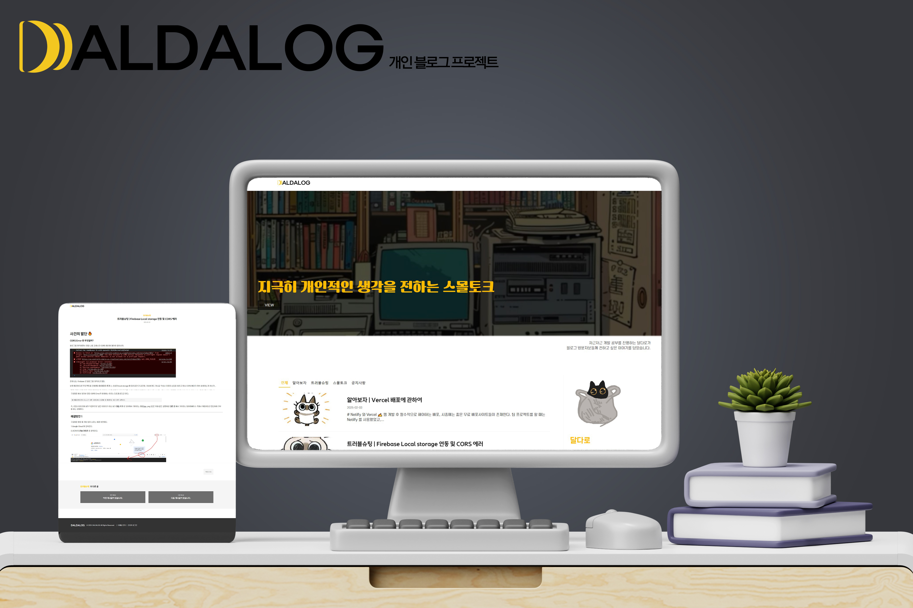
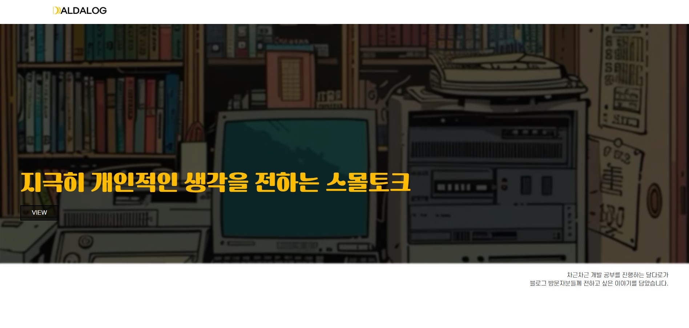
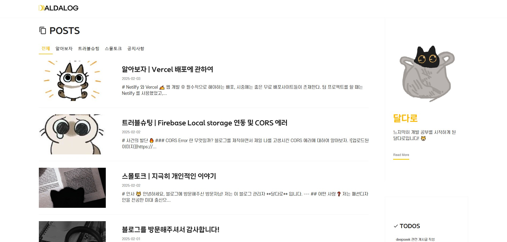
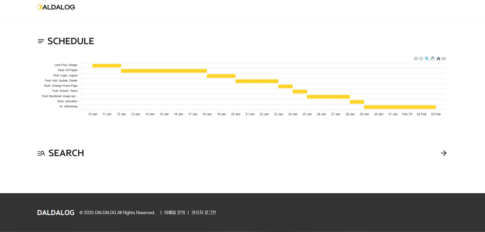
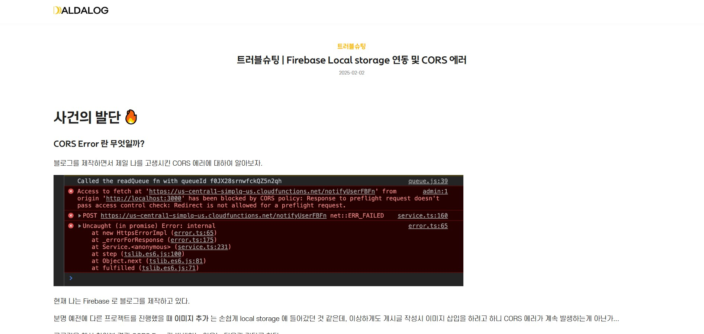
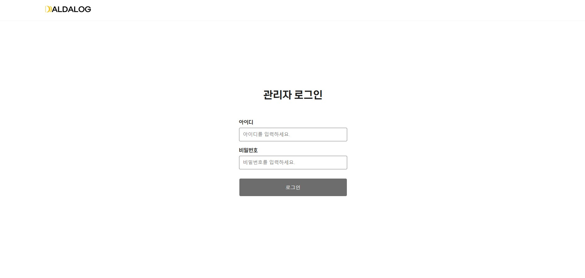
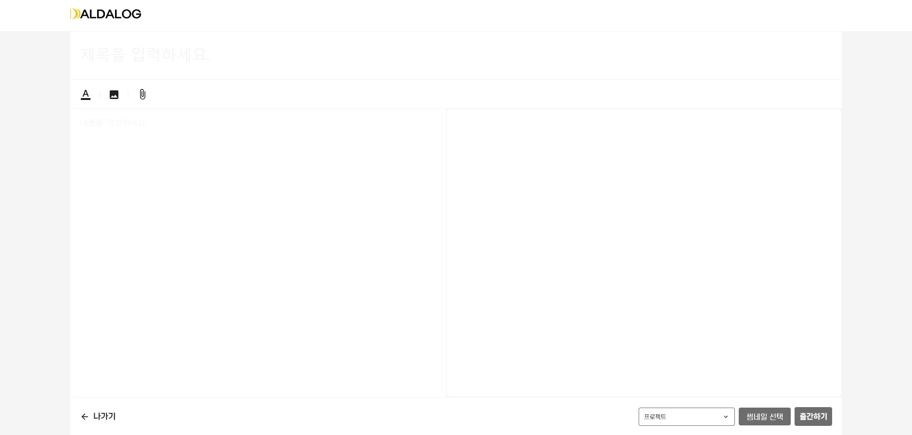
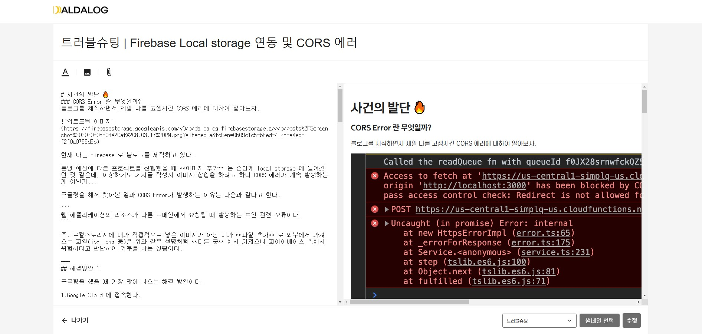

# 개인 블로그 프로젝트 (DALDALOG)

# 프로젝트 소개
흔하게 사용할 수 있는 블로그를 사용하는 대신, 개인의 색깔을 보여줄 수 있는 개인 블로그 입니다.

- 운영자 (admin) 만 게시글 작성, 수정, 삭제가 가능하며, 방문자는 오직 읽기만 가능합니다.

- Todos 를 통해 앞으로의 일정을 공유할 수 있습니다.

- Search 를 통해 원하는 게시글을 찾을 수 있습니다.

- Scheduler 를 통해 개발 기간동안 어떤 개발이 이루어졌는지 한눈에 파악할 수 있습니다.

- TabButton 을 사용하여 목록별로 게시글을 확인할 수 있습니다.

- Detail 페이지에서는 게시글 내용을 확인할 수 있으며, 해당 게시글의 목록에 있는 이전, 다음 게시글로 편하게 이동 가능합니다.

# 프로젝트 규모
개인 프로젝트

# 개발 기간 및 작업 관리
- 전체 개발 기간 : 2025.01.10 - 2025.02.03

- 기획 및 디자인 : 2025.01.10 - 2025.01.12

- 페이지 퍼블리싱 : 2025.01.13 - 2025.01.18

- 기능 구현 : 2025.01.18 - 2025.02.03

## 페이지

### 1. 메인 페이지
- POSTS

  작성된 게시글을 그룹별로 나누어 확인할 수 있습니다.

- TODOS

  앞으로의 개발 일정들을 한 눈에 확인할 수 있습니다.

- SCHEDULER

  개발기간동안 어떠한 개발이 이루어졌는지 확인할 수 있습니다.

- SEARCH

  아이콘 클릭 시 검색 가능 페이지로 이동되어 원하는 게시글을 검색하여 찾아볼 수 있습니다.

### 2. 게시글 상세 페이지
- 관리자는 게시글을 수정, 삭제 가능합니다.

- 사용자는 게시글 내용을 확인 할 수 있습니다.

- 이전, 다음 게시글로 이동하여 편하게 게시글을 확인할 수 있습니다.

### 3. 로그인 페이지
- 관리자 전용 로그인 페이지입니다. 사용자들은 로그인 필요없이 게시글을 확인할 수 있습니다.

### 4. 게시글 작성 페이지
- 관리자 전용 페이지이며, 관리자는 마크다운을 통해 편하게 글 작성이 가능합니다.

### 5. 게시글 수정 페이지
- 관리자 전용 페이지이며, 관리자는 API 를 통해 기존 게시글을 조회하여 불러온 후, 해당 게시글의 내용을 수정할 수 있습니다.

# 기술 스택
- Front : React, Typescript, Vite, emotion, styled-components, Zustand

- Back-end : Firebase

- 버전 및 이슈관리 : Github, Github Issues

- 서비스 배포 환경 : Vercel

- 디자인 : Figma
